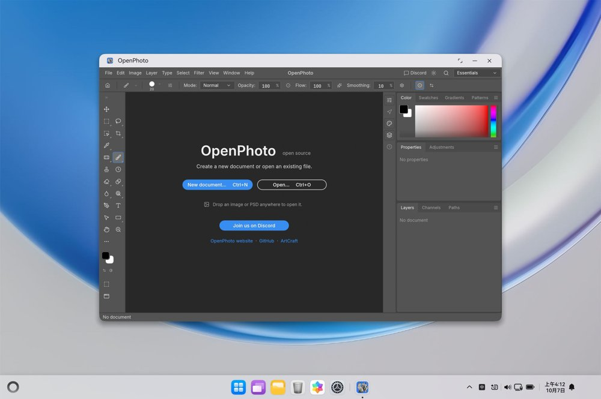
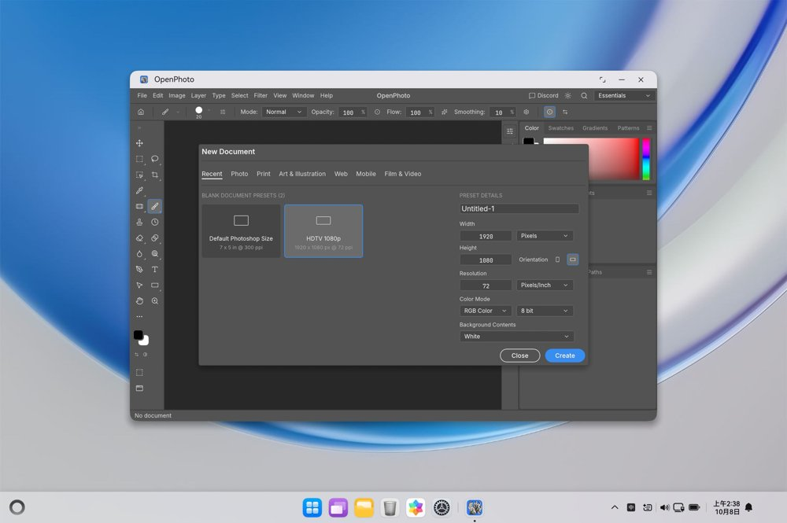
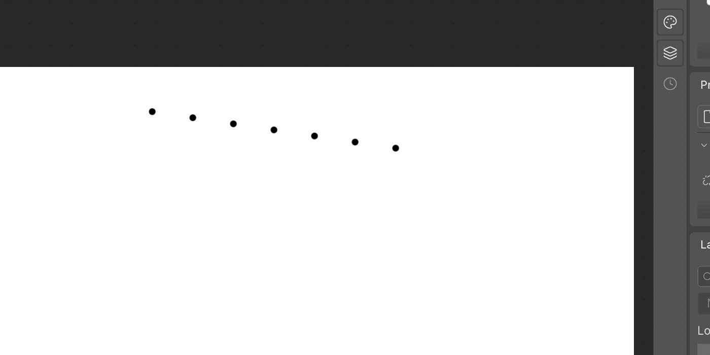
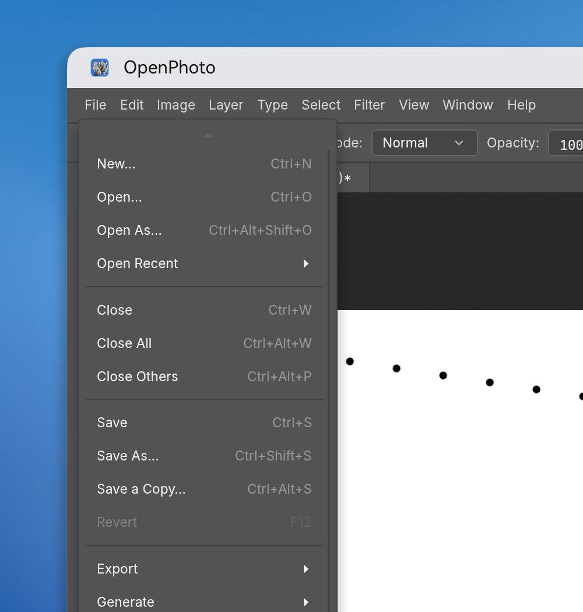
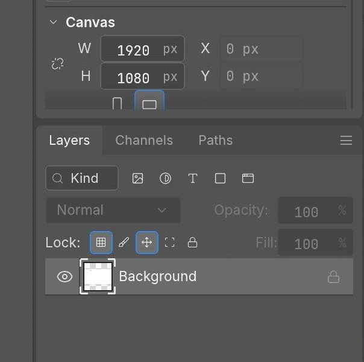
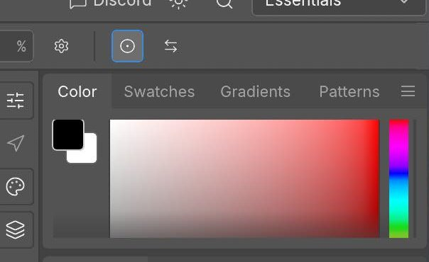
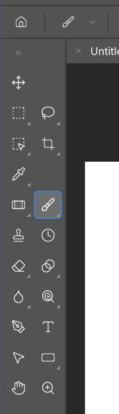
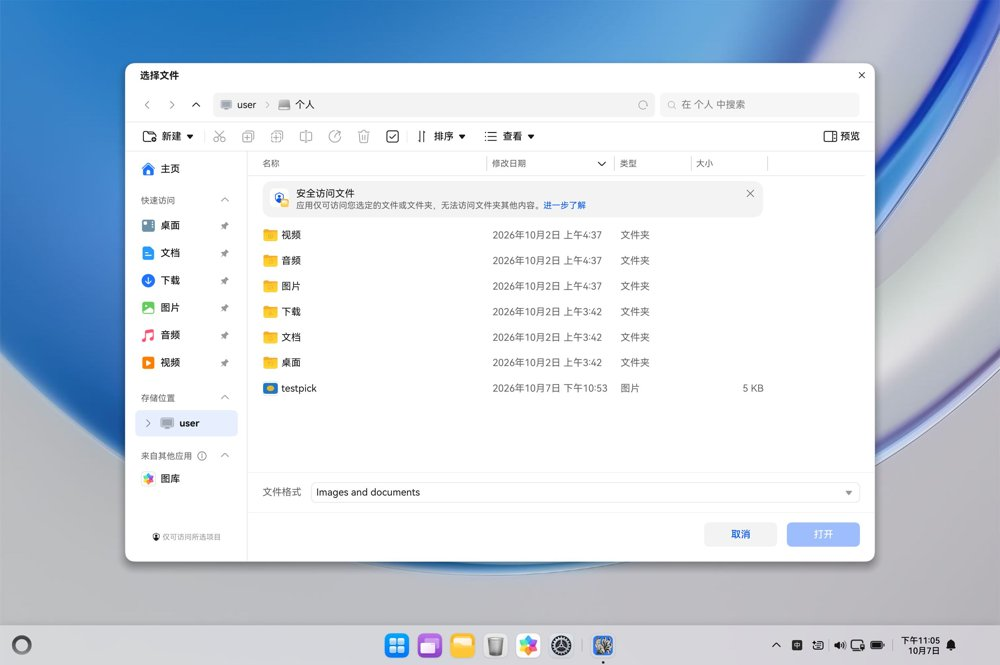

# HarmonyOS port

OpenPhoto runs natively on HarmonyOS (phones, tablets and 2-in-1 PCs) from the **same Rust
sources** as the desktop app — no re-implementation. The port adds a thin platform shell; the
editor, its UI and its GPU canvas are the shared `openphoto-ui-egui` crate.

```text
harmony/                        ArkTS shell (EntryAbility + full-bleed XComponent)
  entry/libs/arm64-v8a/         libopenphoto_native.so (built by scripts/ohos-build.sh)
apps/openphoto-ohos/            Rust native module: Ability entry, winit event loop,
                                egui frame driver, wgpu renderer, HarmonyOS services
```

At runtime the ArkTS `XComponent` owns an `OH_NativeWindow`; `winit-ohos` turns Ability lifecycle,
surface and input callbacks into winit events; the host feeds them to the same `OpenPhotoApp` the
desktop shell runs (via `update_logic`/`update_ui`, the platform-free passes `eframe::App` calls
into); `egui-wgpu` paints into a wgpu surface created from the native window (Vulkan on devices,
OpenGL ES on the emulator, which has no Vulkan driver).

## Prerequisites

- Rust stable with the OHOS target: `rustup target add aarch64-unknown-linux-ohos`.
- The Huawei command-line tools (hvigor, ohpm, SDK, emulator). The scripts expect them at
  `~/Developer/command-line-tools`; override with `CLT=…` in the environment if yours live
  elsewhere. A Java runtime is needed for signing (`/opt/homebrew/opt/openjdk@17` works on macOS).
- A booted emulator with hdc visible (`hdc list targets`). **Cold-boot the PC emulator once**
  (`isHotBoot=false` in its `config.ini`): a hot-booted snapshot can wedge its hdc bridge so the
  device stays `Offline` forever.

## Build, sign, install

```sh
./scripts/ohos-sign.sh [--udid <device-udid>]   # once per emulator: local debug signing material
./scripts/ohos-build.sh [--debug] [--skip-rust] [--skip-hap]
```

`ohos-build.sh` cross-compiles `openphoto-ohos` for `aarch64-unknown-linux-ohos`, stages and
strips `libopenphoto_native.so` into `harmony/entry/libs/arm64-v8a/`, runs `ohpm install` and
`hvigor assembleHap`, then signs the unsigned HAP with the SDK's `hap-sign-tool` and the material
from `ohos-sign.sh`. The signed HAP lands in
`harmony/entry/build/default/outputs/default/entry-default-signed.hap`.

Signing is fully local (root CA → app/profile sub-CAs → certs → signed provisioning profile), so
no Huawei developer account is needed for emulator installs. `harmony/signing/` holds the keys and
is gitignored; `harmony/build-profile.json5` intentionally carries **no** signing config because
hvigor only accepts DevEco-encrypted passwords — signing happens in the script instead.

```sh
hdc -t <target> install harmony/entry/build/default/outputs/default/entry-default-signed.hap
hdc -t <target> shell aa start -a EntryAbility -b ai.storyteller.openphoto
hdc -t <target> shell "hilog -x -T OpenPhoto"   # rust logs land in hilog under this tag
hdc -t <target> shell "snapshot_display -f /data/local/tmp/shot.jpeg"  # screenshot
```

## Screenshots (HarmonyOS PC emulator)










## Behavioural notes

- Startup is fast (editor init ~100–200 ms on the emulator); the first frame waits for the
  XComponent surface, exactly like desktop window creation.
- The wgpu device, adapter and egui renderer live for the whole session; only the swap chain is
  recreated across backgrounding and screen lock, so UI textures (fonts, icons) survive them.
- Touch, mouse motion, gestures (pinch zoom, pan scroll) and the IME map onto the same egui events
  the desktop backend produces (`apps/openphoto-ohos/src/input.rs` mirrors `egui-winit`). The
  mapping is covered by host-side unit tests (`cargo test -p openphoto-ohos`).
- **File dialogs work end to end, verified on the emulator.** `pick_open` fires the system picker
  (with the desktop format filters) on a worker thread; the chosen files resolve through FileUri,
  are read, and arrive via the `inbox`, which the UI opens like any dropped file. `pick_save`
  saves to the app's Documents directory immediately (unique-ified, so Save always works with one
  click) and fires the system save dialog in parallel; on confirm the file is copied to the chosen
  URI and later writes redirect there, so File › Save keeps working. Cancelling keeps the Documents
  copy. The bridge call times out after 60 s (fixed in the plugin facade); a timeout only loses the
  dialog, never the document. The save picker does not prefill the filename (its options have no
  filename field), so the user types it.
- Mouse button presses from `uinput`-injected events do not reach the XComponent on the emulator
  (moves do; touch presses paint normally). The Press→`PointerButton` mapping is in place and
  covered by unit tests, so real hardware should just work — it still wants a real-mouse check.
- Keyboard events likewise never arrive from `uinput` on this emulator (the XComponent key
  callback is registered; the system swallows injected keys), so shortcuts and text input are
  implemented and unit-tested but still want a real-keyboard check.
- Performance: the frame path is the same code as desktop (egui-wgpu + custom WGSL canvas, damage
  tracking, tile uploads). The emulator renders through GLES on a virtual GPU, so its frame rate is
  not representative; real devices use Vulkan on real GPUs. Device limits are clamped to what the
  driver reports (`adapter.limits()`), which is what makes the emulator's GLES driver work at all.

## Troubleshooting

| Symptom | Fix |
|---|---|
| `hdc list targets` shows the PC emulator `Offline` | Cold-boot it once (`isHotBoot=false`), then `hdc kill` to reset the server. |
| `SignHap` fails on passwords | Expected: don't put passwords in `build-profile.json5`; sign with `ohos-build.sh`. |
| `install` rejects the HAP | Re-run `ohos-sign.sh` for the target's UDID (`bm get --udid`) and rebuild. |
| UI chrome missing after lock/unlock | Fixed by the long-lived device (see above); restart the app if you see it on old builds. |
| Emulator locks during testing | `power-shell timeout -o <ms>` is unreliable; re-unlock with a swipe + user tap. |
